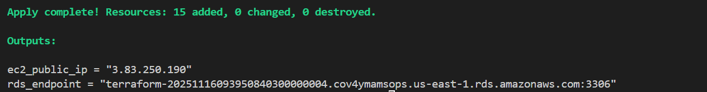

# 🚀 EpicBook AWS Infrastructure (EC2 + RDS) with Terraform and Ansible

This Terraform and Ansible project provisions and configures a secure, production-ready AWS environment for hosting a web application - **EpicBook**. It includes:

- A custom VPC with public and private subnets across two Availability Zones  
- A publicly accessible EC2 instance for the frontend application 
- A private, highly available Amazon RDS MySQL instance for the database tier
- Proper networking, security groups, and IAM-free access control 
- Secure SSH key-based authentication
- Complete configuration by ansible with database connections

All resources are deployed in the us-east-1 region (configurable).

---

## 📁 Project Structure

```bash
theepicbook_terraform_ansible/aws_epicbook/
├── ansible/
   ├── group_vars/
      ├── web_yml          # role-wide variables
   ├── roles/
      ├── common/          # install important packages
      ├── db/              # configure database 
      ├── deploy_epicbook/ # clone the github repo of the application
      ├── nginx/           # configure nginx
      ├── pm2/             # run the theepicbook application as a service
   ├── inventory.ini
   ├── site.yml
├── terraform/
   ├── main.tf             # Core infrastructure definitions
   ├── variables.tf        # Input variables (customizable)
   ├── outputs.tf          # Useful outputs after deployment
└── README.md              # This file
```

---

## 🛠️ Prerequisites

Before you deploy, ensure you have:

1. **[Terraform](https://www.terraform.io/downloads.html)** installed (`v1.3+` recommended)
2. **[AWS CLI](https://aws.amazon.com/cli/)** installed and configured
3. **[Ansible CLI](https://docs.ansible.com/projects/ansible/latest/installation_guide/intro_installation.html#control-node-requirements)** installed and configured
3. An SSH key pair for EC2 access (or generate one as shown below)

---

## 🔐 SSH Key Setup

You must provide an SSH public key for secure EC2 access.

### Option A: Use an existing key
- Ensure your public key (e.g., `~/.ssh/id_rsa.pub`) exists.
- Set `ssh_public_key_path` in `terraform.tfvars` (see below).

### Option B: Generate a new key (Linux/macOS)
```bash
ssh-keygen -t rsa -b 2048 -f ~/.ssh/id_rsa -N ""
```

## ⚙️ Terraform Configuration

Go into the terraform directory 

```bash
cd terraform
```

### 1. Create `terraform.tfvars`
Create a file named `terraform.tfvars` in this directory to set your variables:

```hcl
# terraform.tfvars
region            = "us-east-1"
vpc_name          = "epicbook-vpc"

# EC2
ssh_public_key_path = "~/.ssh/id_rsa.pub"  # Path to your PUBLIC key

# RDS
rds_password       = "MySecurePassword123!"  # Must be 8-41 chars, include letters & numbers
```

---

## ▶️ Deployment

1. **Initialize Terraform**:
   ```bash
   terraform init
   ```

2. **Preview changes**:
   ```bash
   terraform plan
   ```

3. **Deploy**:
   ```bash
   terraform apply
   ```

4. Approve the plan when prompted.

> ⏱️ Deployment takes about **5–10 minutes**.

---

## 📤 Outputs

After deployment, Terraform shows useful info like:



Use these to connect to your resources and update the variables file for ansible.

---

## 🔌 Connecting to Your Resources

### SSH into EC2 Instance

On the command line:

```bash
ssh ubuntu@<ec2_public_ip>
```

## Ansible Configuration

Go into the ansible directory 

```bash
cd ../ansible
```

Update group_vars/web.yml with the rds_endpoint output from terraform. Also update the password used in terraform.tfvars

```bash
db_host: <rds_endpoint>
db_password: <rds_password>
```

Update inventory.ini with the ec2_public_ip output from terraform

```bash
[web]
<ec2_public_ip>
```

Run the below command on the command-line to configure theepicbook application:

```bash
ansible-playbook -i inventory.ini site.yml
```

You should get something like the below result if ran successfully:


### 3. Verify the configuration
Check if the application is running:

```bash
http://<PublicIP>
```

If there are no errors when ansible runs, you should see The EpicBook application running.


---

## 🧹 Cleanup

To destroy all resources and avoid charges:

```bash
cd ../terraform
terraform destroy
```

---

## 📌 Best Practices Implemented

- ✅ VPC with public/private subnets (multi-AZ)
- ✅ RDS in private subnets, not publicly accessible
- ✅ Security groups restrict access (EC2 → RDS only)
- ✅ SSH key authentication (no passwords)
- ✅ No hardcoded credentials in code (use `tfvars` or env vars)
- ✅ DB subnet group meets AWS high-availability requirements
- ✅ Idempotency and database management
- ✅ Ansible configuration and organization
---

